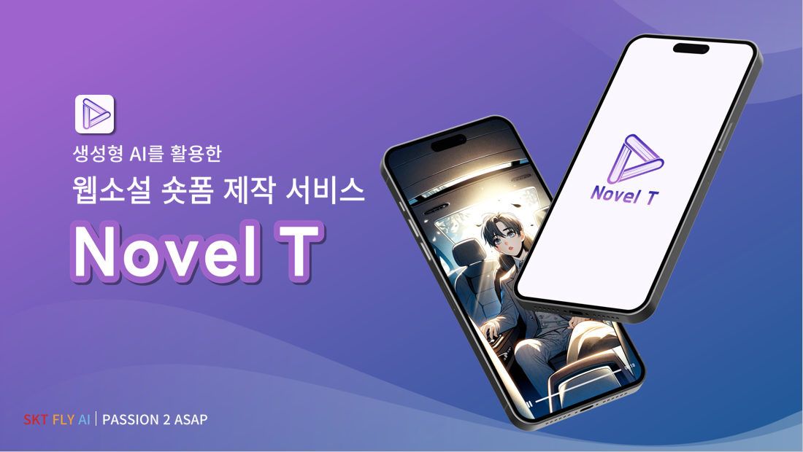
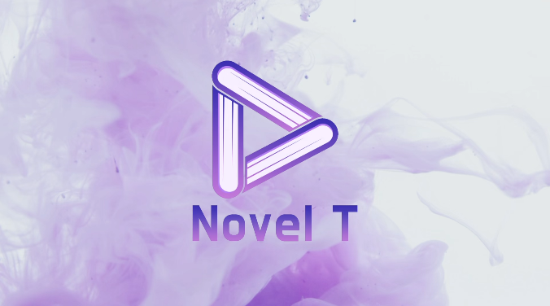
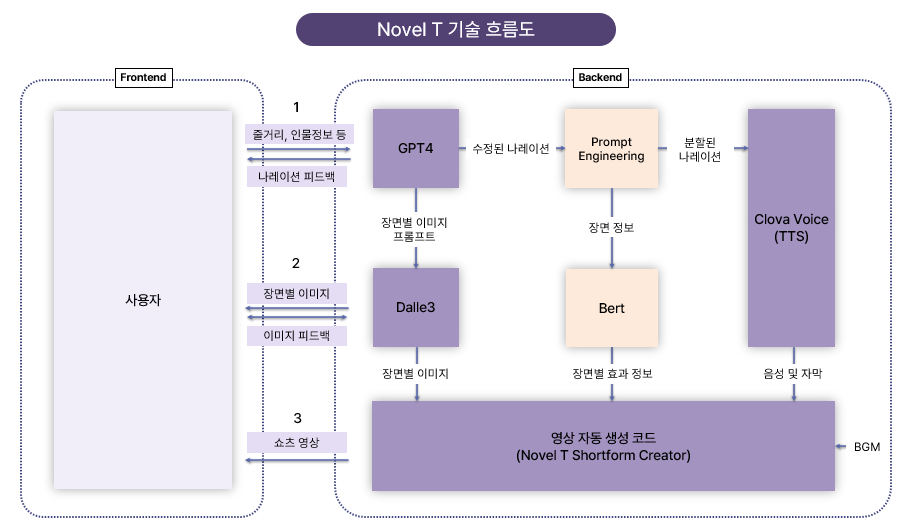
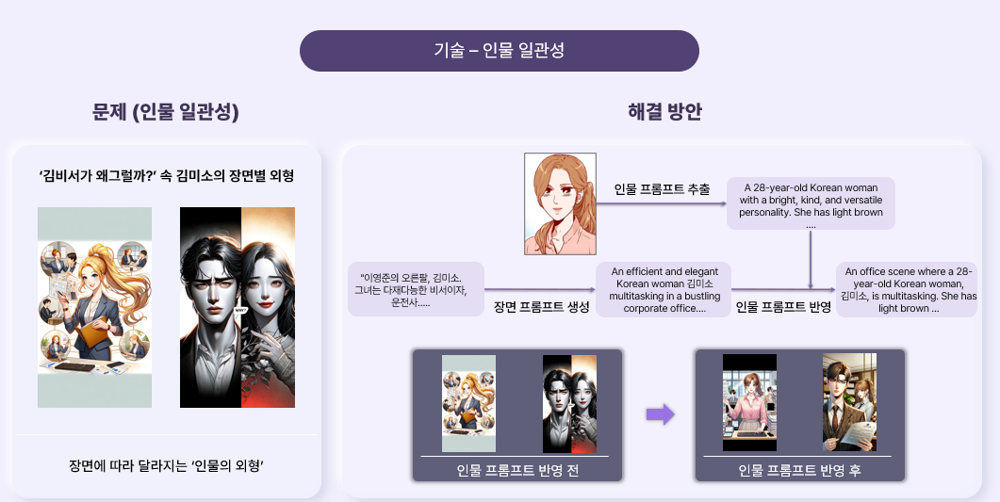
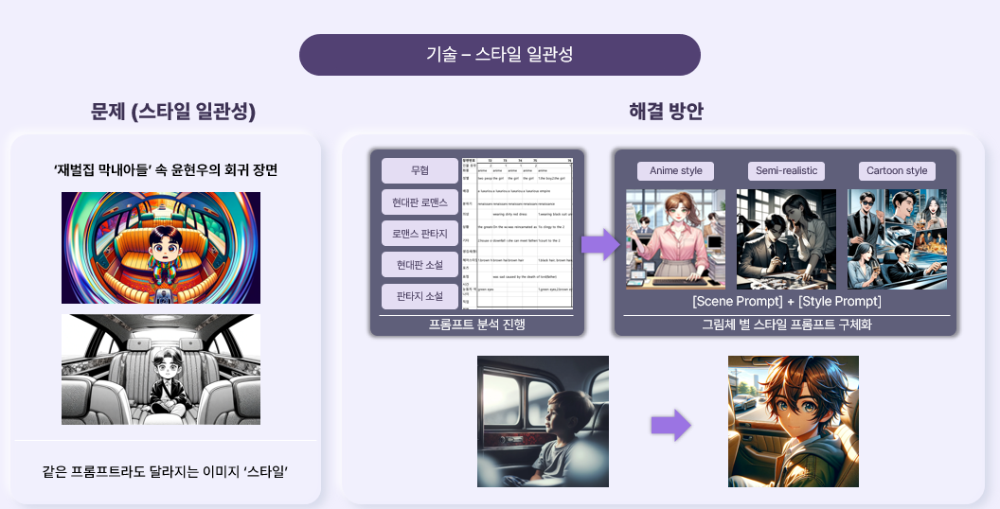
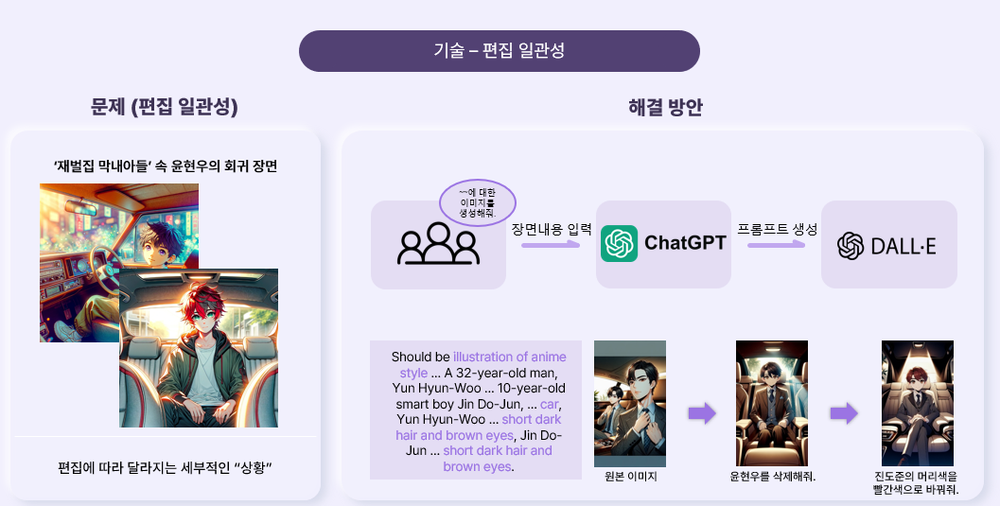
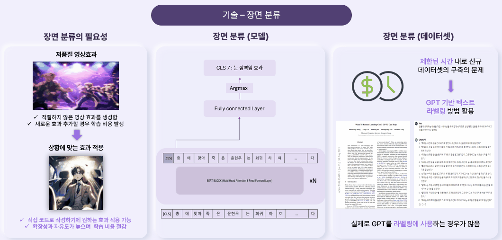
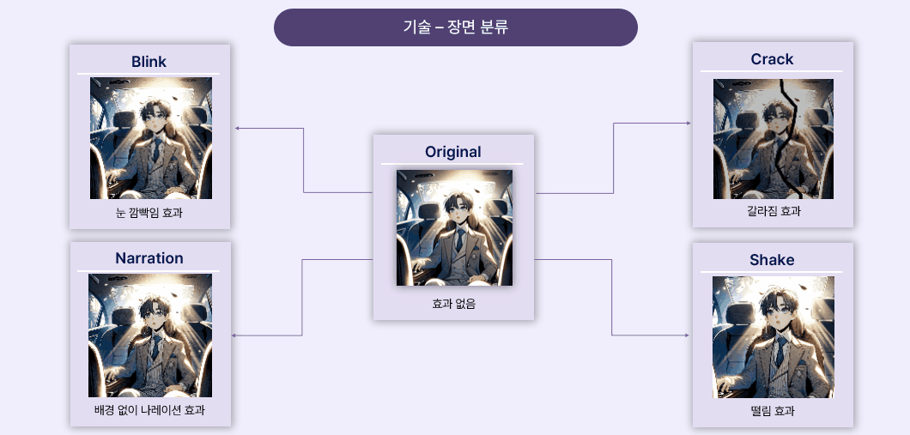
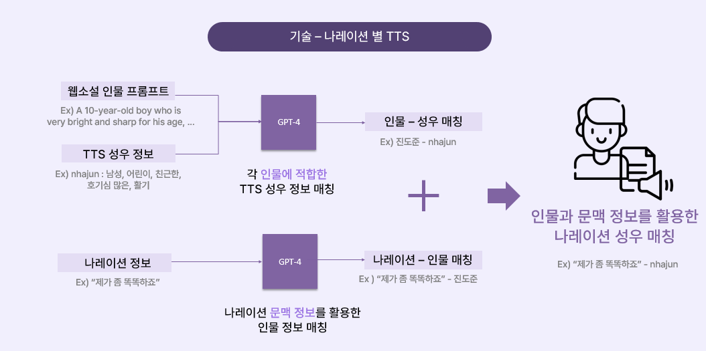
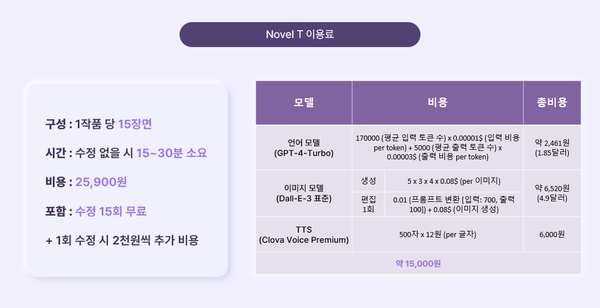

# NovelT-SKT-FLY-AI-Passion2 

**SKT-FLY-AI-Challenger 열정 2조 - 속전속결 (2024-02-01 ~ 2024-02-29) [Excellence Award]**



**[FLY AI 수상자 인터뷰 : 웹소설 숏폼 생성Ai 프로젝트, 노벨티(Novel T) ... - 트렌드 와칭](https://www.trendw.kr/news/articleView.html?idxno=10602)**

**[Velog : SKT FLY AI Challenger 4기 수료 후기](https://velog.io/@pre_f_86/SKT-FLY-AI-Challenger-4%EA%B8%B0-%EC%88%98%EB%A3%8C-%ED%9B%84%EA%B8%B0)**

---

## 배경

최근 **웹 소설 시장은 크게 발전**하고 있다. 이러한 흐름에서 웹소설 작가들이 성공하기 위해서는 **마케팅적인 요소가 굉장히 중요**하다. 하지만 대형 플랫폼에 속하지 않은 웹소설 작가 혹은 신인 작가들은 **마케팅 부분에서 어려움**을 겪는 경우가 많다. NovelT 서비스는 이러한 문제를 해결하기 위해 최근 떠오르는 효과적인 마케팅 수단인 **‘숏폼 마케팅’**을 이용하고자 하였고, 웹소설 **작가의 줄거리를 입력받으면 작가 자신만의 숏폼 영상을 생성하도록 하여 이를 광고요소로 사용할 수 있도록 한다.**

## 소개영상

<p align="center"><a href="https://youtu.be/IyemqQwLrKw"></a></p>

- [Youtube : SKT FLY AI 4기 속전속결 - NovelT Intro영상](https://youtu.be/IyemqQwLrKw)

- [Youtube : SKT FLY AI 4기 속전속결 - NovelT 결과영상](https://youtube.com/shorts/CIQHzbUIYzw)

## 팀 내 역할 (백엔드, AI)

- AI 파트
    
    - 프롬프트 엔지니어링을 통한 줄거리 기반 콘텐츠 생성 및 이미지 일관성 향상

    - 나레이션(Text) 기반 영상 효과 분류(Classification) 모델 학습, 라벨링

    - 줄거리와 인물의 정보를 담은 나레이션별 성우 매칭 알고리즘 고안

- 백엔드 파트

    - 기능 분석 및 Database ERD 설계

    - NovelT의 Flow를 진행할 수 있도록 파이프 라인 구성

    - NovelT만의 자체 Shortform creater 구현

## Architecture




<details>
<summary><b>기술 요약</b></summary>
<div markdown="1">
<h2><b>프롬프트 엔지니어링 (인물, 스타일, 편집)</b></h2>

- 인물 일관성 : 장면이 변하더라도 인물의 일관성은 유지됨



- 스타일 일관성 : 장면이 변하더라도 그림체 스타일은 유지됨



- 편집 일관성 : 편집을 하더라도 장면의 상황, 스타일은 유지됨



<h2> BERT 기반 장면 분류 </h2>

- 나레이션은 장면에 대한 정보를 담고 있다고 판단하여 나레이션을 기반으로 Classification을 진행하여 적합한 영상 효과 매칭하도록 직접 KoBERT를 통해 구현



<h2> 장면효과 </h2>

- 숏폼영상에 자주 보이는 영상 효과를 분석하여 NovelT만의 영상효과 직접 구현



<h2> 나레이션-성우 매칭 알고리즘 </h2>

- 모든 영상에 동일한 성우를 사용한다면 영상의 몰입감이 떨어진다고 판단



</div>
</details>


## Cost



## How to Use

1. 깃허브를 clone한다.
    ```
    git clone https://github.com/PreFKim/NovelT-SKT-FLY-AI-Passion2.git

    conda env create -f environment.yaml
    ```

2. ./api/config.py 내부에 OpenAI의 API키와 Clova Voice의 API 키를 입력한다.

    ```python
    # OpenAI API
    api_key = "" # Your OpenAI API Key

    # GPT
    model = "gpt-4-0125-preview"
    temperature = 1
    max_tokens = 2048
    top_p = 1

    # DALL-E
    model_dalle = "DALL-E-3"
    size = "1024x1792", # 1024x1024, 1024x1792 or 1792x1024, 쇼츠에 적합하게 width < height
    quality = "standard" # DALL-E3 사용시 'hd' 가능

    # Clova voice API
    client_id = "" # Your Clova API ID
    client_secret = "" # Your Clova API Secret
    ```


3. tutorial.ipynb 파일을 실행하여 user_inputs 변수를 설정한다.

    ```python
    user_inputs = {
        "novel" :{
            "제목" : "재벌집 막내아들",
            #"장르" : "로맨스 판타지",
            "강조요소": "회귀 전 윤현우의 행보와 억울함을 자세히 표현했으면 좋겠어.\n...",
            "줄거리" : "흙수저 출신 윤현우는 운이 좋게 대기업 '순양그룹'에 입사하여 재벌 3세들의 뒤치다꺼리를 하며 머슴처럼 일했다. 그렇게 회사 안에서 그의 입지는 커지고 회사의 신뢰를 받게 된다.\n\n그러던 어느날, ..."
        },
        "characters" : [
            {
                "이름" :  "윤현우",
                "나이" :  "32",
                "성격" : "오너 일가에 대한 충성심을 지킴, 의리 있음",
                "의상" : "단정한 오피스룩",
                #"img" : f"{character_path}/윤현우.webp" # 외형을 참고할 이미지가 있다면 해당 이미지 파일의 경로를 입력
            },
            {
                "이름" : "진도준",
                "나이" : "10",
                "성격" : "똘똘함",
                "의상" : "단정하고 고급스러운 옷",
            },
            {
                "이름" : "성인 진도준",
                "나이" : "22",
                "성격" : "똘똘함",
                "의상" : "단정하고 고급스러운 옷",
            },
            {
                "이름" : "진양철",
                "나이" : "71",
                "성격" : "괴팍함, 미래에 대한 통찰력 있음",
                "의상" : "고급스러운 정장",
            }
        ],
        "style" : "anime style"
    }
    ```

4. 함수들을 순차적으로 실행한다.

    - forward_gpt() : 줄거리를 기반으로 장면 별 나레이션, 영상 효과, 장면 이미지 프롬프트, 등장인물 프롬프트를 생성하고 API 사용량을 계산

    - create_image() : 각 장면의 프롬프트를 기반으로 $n$개의 이미지를 생성

    - edit_image() : 편집 내용을 기반으로 기존 장면 프롬프트를 일관성 있게 수정하고 수정된 프롬프트를 기반으로 이미지 생성

    - get_subtitle() : 각 장면의 나레이션을 호흡의 길이에 맞게 두개로 나누어 적절한 자막의 길이로 전환

    - create_voice() : 등장인물의 특징을 통해 각 등장인물에 성우를 매칭하고, 나레이션별로 등장인물을 매칭하여 각 나레이션별 적절한 성우를 배치하도록 지정하여 음성 생성

    - create_video() : 생성된 콘텐츠들을 기반으로 숏폼 영상을 생성


## Directory
    NovelT-SKT-FLY-AI-PASSION2
        ├─ api
        │   ├─  __init__.py  
        │   ├─  clova.py            # Hyper Clova의 TTS 담당
        │   ├─  config.py           # API의 파라미터 담당
        │   ├─  gpt.py              # OpenAI의 GPT, DALLE API 호출 담당
        │   └─  shorts.py           # Shortform 영상 생성 담당
        ├─ fonts
        │   └─  ...
        ├─ img
        │   └─  ...
        ├─ shortform_creater
        │   ├─  __init__.py  
        │   ├─ effect               # 영상 효과
        │   │   └─  ...
        │   ├─ transition           # 영상 전환 효과
        │   │   └─  ...
        │   ├─  __init__.py
        │   ├─  operataion.py       # 부가적인 연산 담당
        │   └─  video.py            # 장면, 프레임 등의 정보를 담당하는 메인 클래스
        ├─ .gitignore
        ├─ environment.yaml
        ├─ README.md
        └─ tutorial.ipynb       